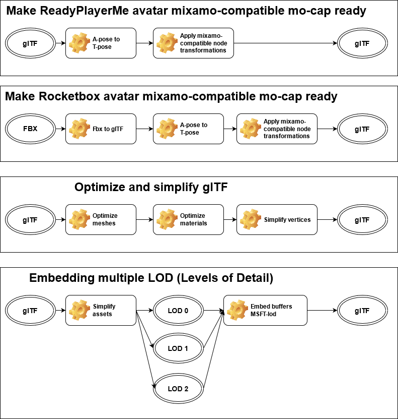

# :diamond_shape_with_a_dot_inside: avatar-asset-pipeline [](https://github.com/infosia/avatar-asset-pipeline/actions/workflows/cmake.yml) 

Avatar asset pipeline is a tool to create continuous integration build pipelines for avatar development using set of common transformation logic as a components, such as "A-pose to T-pose". The build pipelines are defined in a declarative way using JSON file.

**[[[Work In Progress]]]**

## Background

  

<sub>[The Tower of Babel (Vienna) By Pieter Brueghel the Elder - Google Cultural Institute](https://commons.wikimedia.org/w/index.php?curid=22178101)</sub>

> According to the story, a united human race in the generations following the Great Flood, speaking a single language and migrating eastward, comes to the land of Shinar. There they agree to build a city and a tower tall enough to reach heaven. God, observing their city and tower, confounds their speech so that they can no longer understand each other, and scatters them around the world. 

Avatar asset pipeline is aiming to help common workflows for both 3D artist and avatar asset user. Avatar pipeline helps you to:

* Create multiple LOD (Level of Details) assets in order to support multiple platforms such as standalone VR headset device like Oculus Quest, while preserving your original asset clean
* Create T-pose asset from A-pose asset so 3D artist don't have to do it manually every time asset is updated
* Create glTF asset using 3rd party vendor extensions such as VRM without using Unity nor other 3D DCC tools at all
* Integrate build pipeline onto your CI build environment as everything can be done on command line interface with easy-to-read-and-update JSON configurations.


## Common transformations in practice


```json
{
  "name":"glb_T_pose",
  "description":"T-pose from A-pose glTF binary (.glb) and make bones mo-cap ready",
  "pipelines":[
    {
      "name":"gltf_pipeline",
      "components":[
        "glb_T_pose",
        "glb_transforms_apply"
      ]
    }
  ]
}
```




## Common transformations for VRM

### Convert A-pose to T-pose, glTF binary (.glb) to VRM spec 0.0

```json
{
  "name":"glb2vrm0_T_pose",
  "description":"Convert A-pose to T-pose, glTF binary (.glb) to VRM spec 0.0",
  "pipelines":[
    {
      "name":"gltf_pipeline",
      "components":[
        "glb_T_pose",
        "glb_transforms_apply",
        "glb_z_reverse",
        "vrm0_fix_joint_buffer",
        "vrm0_default_extensions"
      ]
    }
  ]
}
```

### Convert glTF binary (.glb) to VRM spec 0.0, forcing all jpeg textures to png

This has been needed to support platforms that do not enable jpeg texture such as [Cluster](https://cluster.mu/en/).

```json
{
  "name":"glb2vrm0",
  "description":"Convert glTF binary (.glb) to VRM spec 0.0, forcing all jpeg textures to png",
  "pipelines":[
    {
      "name":"gltf_pipeline",
      "components":[
        "glb_transforms_apply",
        "glb_z_reverse",
        "glb_jpeg_to_png",
        "vrm0_fix_joint_buffer",
        "vrm0_default_extensions"
      ]
    }
  ]
}
```


## Combining multiple pipelines

```js
{
  "name":"fbx2glb_tpose",
  "description":"Convert FBX to glTF binary (.glb), make it T-pose and then VRM 0.0",
  "pipelines":[
    {
      "name":"fbx_pipeline",
      "components":[
        "fbx2gltf_execute"
      ]
    }, 
    {
      "name":"gltf_pipeline",
      "components":[
        "glb_T_pose",
        "glb_transforms_apply",
        "glb_z_reverse",
        "vrm0_fix_joint_buffer",
        "vrm0_default_extensions"
      ]
    }
  ]
}
```


## Convert FBX to glTF

Conversion of FBX to glTF using `fbx_pipeline` requires [FBX2glTF executable](https://github.com/facebookincubator/FBX2glTF/releases). In order to use FBX2glTF with asset pipeline you need to specify a path to the executable using `--fbx2gltf` option such as `--fbx2gltf bin/fbx2gltf.exe`.

## Bone naming conventions

avatar asset pipeline follows Blender-like naming conversions in order to search for humanoid bone retargeting.

> First you should give your bones meaningful base-names, like “leg”, “arm”, “finger”, “back”, “foot”, etc.
> If you have a bone that has a copy on the other side (a pair), like an arm, give it one of the following separators:
>
> * Left/right separators can be either the second position “L_calfbone” or last-but-one “calfbone.R”.
> * If there is a lower or upper case “L”, “R”, “left” or “right”, Blender handles the counterpart correctly. See below for a list of valid separators. Pick one and stick to it as close as possible when rigging; it will pay off.
>
> Examples of valid separators:
>
> * (nothing): handLeft –> handRight
> * “_” (underscore): hand_L –> hand_R
> * “.” (dot): hand.l –> hand.r
> * “-” (dash): hand-l –> hand-r
>* ” ” (space): hand LEFT –> hand RIGHT

<sub>https://docs.blender.org/manual/en/latest/animation/armatures/bones/editing/naming.html</sub>

You can explicitly specify bone naming conversions by using `--input_config` option such as `--input_config models/input.mixamo.json`. Checkout `models/input.*.json` for commonly used bone naming conversions.

```js
{
  "config":{
    "pattern_match": true, // pattern match ("Hips" matches "mixamorig:Hips" too)
    "with_any_case": true, // case insensitive
  },
  "bones":{
    "hips":"Hips",
    "leftUpperLeg":"LeftUpLeg",
    "rightUpperLeg":"RightUpLeg",
    "leftLowerLeg":"LeftLeg",
    "rightLowerLeg":"RightLeg",
    "leftFoot":"LeftFoot",
    "rightFoot":"RightFoot",
    "spine":"Spine",
    "chest":"Spine1",
    "neck":"Neck",
    "head":"Head",
    "leftShoulder":"LeftShoulder",
    "rightShoulder":"RightShoulder",
    ...
  }
}
```

## Usage

Check out `pipelines` directory for working pipeline examples in practice.

```
> avatar-build --pipeline pipelines/glb2vrm0_T_pose.json --debug --output_config models/output.vrm0.json -v --fbx2gltf extern/fbx2gltf.exe --input_config models/input.readyplayerme.json -i models/readyplayerme-feminine.glb -o models/readyplayerme-feminine.vrm
```

## Options

* `--pipeline`: Pipeline configuration file name (JSON);
* `--verbose`: verbose Verbose log output
* `--debug`: Enable debug output (such as JSON dump)
* `--input`: Input file name
* `--output` "Output file name
* `--input_config`: Input configuration file name (JSON)
* `--output_config`: Output configuration file name (JSON)
* `--fbx2gltf`: Path to fbx2gltf executable


## License

* Available to anybody free of charge, under the terms of MIT License (see LICENSE).

## Building

You need [Cmake](https://cmake.org/download/) and Visual Studio with C++ environment installed. There is a CMakeLists.txt file which has been tested with [Cmake](https://cmake.org/download/) on Windows. For instance in order to generate a Visual Studio 10 project, run cmake like this:


```
> mkdir build; cd build
> cmake -G "Visual Studio 10" ..
```
